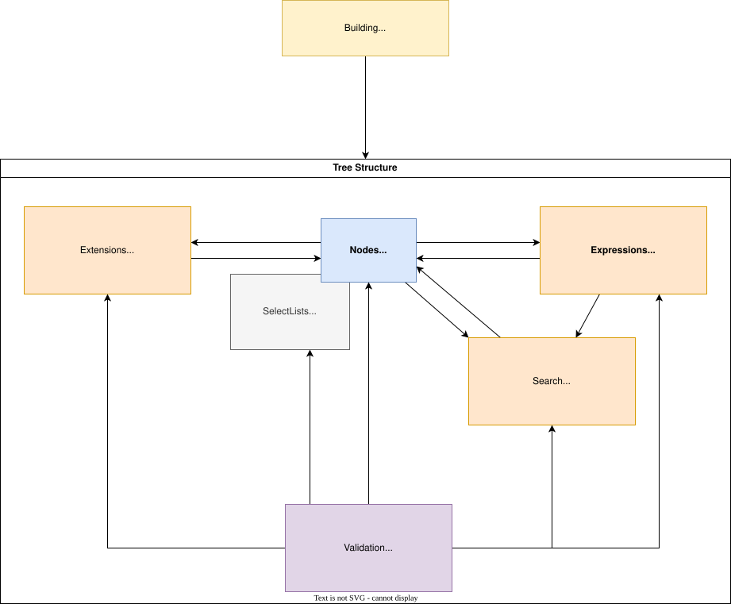
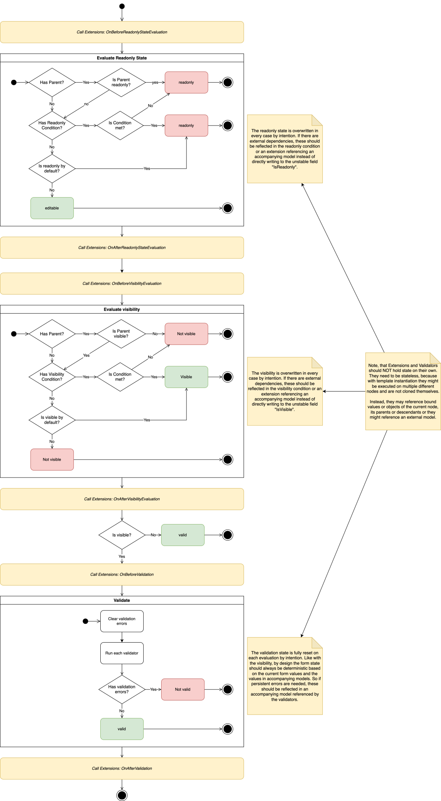

# Technical documentation of RobinEpple.Common.Forms

([back to readme](common_forms.md))

If you want to add your own functionality, or you are interested in the inner workings of the form framework, this page is meant to give you an overview while navigating this ever growing pile of code ;)

## Table of Contents

- [High level overview](#high-level-overview)
- [Node type hierarchy](#node-type-hierarchy)
    - [IFormNode — the base of everything](#iformnode--the-base-of-everything)
    - [Leaf nodes: IFieldNode and IValueNode\<TValue\>](#leaf-nodes-ifieldnode-and-ivaluenodetvalue)
    - [Container nodes: IParentNode, IForm, ICollectionNode, ITemplateNode](#container-nodes-iparentnode-iform-icollectionnode-itemplatenode)
    - [IScopeProvider — who can see whom](#iscopeprovider--who-can-see-whom)
- [Node identity and path computation](#node-identity-and-path-computation)
- [ResettableProperty\<T\> — the state primitive](#resettablepropertyt--the-state-primitive)
- [Scoping system](#scoping-system)
- [Tree traversal](#tree-traversal)
- [Search](#search)
- [Expression system](#expression-system)
    - [Core concept](#core-concept)
    - [Scope navigation expressions](#scope-navigation-expressions)
    - [Value access expressions](#value-access-expressions)
    - [Combinators and arithmetic](#combinators-and-arithmetic)
    - [Error handling in expressions](#error-handling-in-expressions)
    - [Source generator integration](#source-generator-integration)
- [Update pipeline](#update-pipeline)
    - [Per-node update sequence](#per-node-update-sequence)
    - [Readonly state evaluation](#readonly-state-evaluation)
    - [Visibility evaluation](#visibility-evaluation)
    - [Validation](#validation)
    - [Select list refresh](#select-list-refresh)
    - [Recursive update propagation](#recursive-update-propagation)
- [Validation system](#validation-system)
    - [INodeValidator contract](#inodevalidator-contract)
    - [Built-in validators](#built-in-validators)
- [Extension system](#extension-system)
    - [IFormNodeExtension hooks](#iformnodeextension-hooks)
    - [FormNodeExtensionBase convenience class](#formnodeextensionbase-convenience-class)
- [Value formatting](#value-formatting)
- [Select lists](#select-lists)
- [Data binding system](#data-binding-system)
    - [IFormNodeBinding and IValueAccessor\<T\>](#iformnodebinding-and-ivalueaccessort)
    - [Simple bindings: PropertyBinding and GetterSetterBinding](#simple-bindings-propertybinding-and-gettersetterbinding)
    - [Embedded models](#embedded-models)
    - [Binding for container nodes](#binding-for-container-nodes)
    - [BindingLoader and BindingWriter traversals](#bindingloader-and-bindingwriter-traversals)
- [Templates and recursion](#templates-and-recursion)
    - [Instantiation lifecycle](#instantiation-lifecycle)
    - [Cloning and parent reference fixup](#cloning-and-parent-reference-fixup)
    - [Recursive structures](#recursive-structures)
- [Builder (Flow API)](#builder-flow-api)
    - [FormBuilder and IFormBuilder](#formbuilder-and-iformbuilder)
    - [Node builder hierarchy](#node-builder-hierarchy)
    - [Name validation](#name-validation)
    - [Build finalization](#build-finalization)
- [Tags](#tags)
- [Async support via source generators](#async-support-via-source-generators)
- [Overview over available feature implementations](#overview-over-available-feature-implementations)

## High level overview



The graphic above shows a high level overview over the inner structure of a form. The core is defined through a tree structure of form nodes. The leafs are usually input fields, represented by the interface `IFieldNode`, but they may be grouped in containers. These containers include plain sub-forms (`IForm`), templated sections (`ITemplateNode`) and collections (`ICollectionNode`).

Every node contains a configuration which may include visibility or readonly rules, a select list and more. A search implementation defines which nodes can see each other, and this allows expressions to define inter-field rules. Validators operate on a single node, but may use expressions or search to make decisions based on the node's context. And finally, if the predefined internal update pipeline is not enough for you, an extension system allows to hook into events along the update process. All of this is made accessible through a "Flow API" Form-Builder system.

If you want a deeper look into the tree structure, check out [this class diagram](common_forms_nodes.svg).

## Node type hierarchy

### IFormNode — the base of everything

`IFormNode` is the root interface for **every** node in the form tree. It implements `ICloneable` and defines the following core concerns:

| Concern           | Members                                                                                                            |
| ----------------- | ------------------------------------------------------------------------------------------------------------------ |
| **Structure**     | `Name`, `GetId()`, `Parent`, `Root`, `GetScope()`, `ChangeParent(IParentNode)`                                     |
| **Display**       | `Label` (read/write)                                                                                               |
| **Visibility**    | `IsVisible`, `VisibilityCondition` (`IFormExpression<bool>?`)                                                      |
| **Readonly**      | `IsReadonly`, `ReadonlyCondition` (`IFormExpression<bool>?`)                                                       |
| **Validation**    | `IsValid`, `ValidationErrorsByKey`, `NodeValidators`, `SetValidationError(id, error)`, `RemoveValidationError(id)` |
| **Binding**       | `Binding` (`IFormNodeBinding?`), `LoadFromBinding()`, `WriteToBinding()`                                           |
| **State engine**  | `Reset()`, `Update()`                                                                                              |
| **Extensibility** | `Extensions` (`IEnumerable<IFormNodeExtension>`), `Tags` dictionary, `SetTag(tag, value?)`, `RemoveTag(tag)`       |

The `Name` is the developer-assigned, scope-unique identifier; `GetId()` dynamically computes a globally unique path by walking the parent chain (see [Node identity](#node-identity-and-path-computation)).

The default implementation lives in the `internal abstract class NodeBase`. It stores mutable state in `ResettableProperty<T>` wrappers for `Label`, `IsVisible`, `IsReadonly`, and `IsValid` — all of which can be reset to their configured defaults on every update cycle.

### Leaf nodes: IFieldNode and IValueNode\<TValue\>

`IFieldNode` extends `IFormNode` and adds:

- **`HasUserInteraction`** — a flag that tracks whether the end-user has touched this input. Reset to `false` on `Reset()`. Useful for deciding when to show validation errors in the UI.
- **`Formatter`** (`IValueFormatter`) — responsible for bidirectional conversion between the internal typed value and its string representation (see [Value formatting](#value-formatting)).

`IValueNode<TValue>` extends `IFieldNode` with:

- **`Value`** — the typed value of this input (e.g. `string?` for `ITextNode`, `decimal?` for `INumberNode`).
- **`SelectList`** (`ISelectListSource<TValue>?`) — an optional provider of selectable values.
- **`CurrentSelectListItems`** — the items loaded for the current form state, refreshed on every `Update()`.

The concrete node types are thin interfaces that combine `IFieldNode` + `IValueNode<TValue>`:

| Interface        | Value type  | Default formatter             |
| ---------------- | ----------- | ----------------------------- |
| `ITextNode`      | `string?`   | `TrimTextFormatter`           |
| `INumberNode`    | `decimal?`  | `LocalizedNumberFormatter`    |
| `ITimestampNode` | `DateTime?` | `LocalizedTimestampFormatter` |
| `IBooleanNode`   | `bool?`     | `BooleanFormatter`            |
| `IFileNode`      | `FileValue` | `FileSerializer`              |

`FileValue` is a value struct holding `FileName` (`string?`) and `FileContents` (`byte[]?`).

### Container nodes: IParentNode, IForm, ICollectionNode, ITemplateNode

**`IParentNode`** extends `IFormNode` and exposes the contract that containers provide to their children:

- `GetChildId(IFormNode child)` — computes the unique ID segment for a child.
- `GetChildren()` — returns all immediate children.
- `StackContains(IParentNode node, out int index)` — checks the parent hierarchy for a reference (used in recursion fixup).
- `GetParentAt(int index)` — navigates up `index` layers in the parent chain.

**`IForm`** is a sub-form section (or the root). It extends `IScopeProvider` (and thereby `IParentNode`) and holds:

- `Nodes` — the list of child nodes in this form. Node names must be unique within a form.
- `EmbeddedModel` (`IEmbeddedModel?`) — an optional model object attached to this form instance via the tag system (see [Embedded models](#embedded-models)).

The default implementation `Form` stores children in a `Dictionary<string, IFormNode>` keyed by name, demanding names to be unique in the scope. On `Update()`, it calls `base.Update()` (which handles its own readonly/visibility/validation) and then recursively calls `Update()` on every child, aggregating `IsValid`.

**`ICollectionNode`** extends `IParentNode` and models a **list of polymorphic sub-forms**:

- `Templates` — the set of available form templates.
- `Instances` — the currently instantiated items.
- `Instantiate(IForm template)` — clones a template, resets it, attaches it as a child, and runs the `NodeInitializer`.
- `RemoveItem(IForm instance)` / `Clear()` — remove instances. On `Reset()`, all instances are cleared.

Child IDs include the instance's index: `{parentId}-{index}-{childName}`.

**`ITemplateNode`** extends both `IParentNode` and `IFieldNode`, modeling an **optional, polymorphic sub-form** (0 or 1 instance):

- `Templates` — the available templates.
- `Instance` — the current single instance, or `null`.
- `Instantiate(IForm template)` / `Clear()` — same lifecycle as `ICollectionNode` but for a single item.

Because `ITemplateNode` is also an `IFieldNode`, it has a `Formatter` (a `TemplateFormatter` that formats the current instance's label) and participates in the value pipeline.

### IScopeProvider — who can see whom

`IScopeProvider` is a **marker interface** that extends `IParentNode`. Any node implementing it defines a scope boundary for search and expression evaluation. Currently, only `IForm` implements it.

It provides search methods:

- `FindFirst(predicate, maxDepth?)` / `FindFirst(name, comparer?, maxDepth?)` — breadth-first search within this scope, returns the shallowest match.
- `FindAll(predicate, maxDepth?)` / `FindAll(name, comparer?, maxDepth?)` — breadth-first search returning all matches.

The search traverses **downward** only (into children), never upward into parent scopes.

## Node identity and path computation

Every node's ID is computed dynamically by walking the parent chain — there is no stored ID field. The computation works as follows:

1. **Root form**: The ID is just its `Name`.
2. **Child of a form**: `{parentId}-{childName}` (separator is `IFormNode.PathSeparator`, which is `'-'`).
3. **Child of a collection**: `{parentId}-{instanceIndex}-{childName}` (using `IFormNode.IndexIdentifier` = `"-{0}"`).
4. **Child of a template node**: `{parentId}-{childName}`.

Because IDs are computed from the live parent chain, they update automatically when an instance is re-parented (e.g. after cloning a template).

## ResettableProperty\<T\> — the state primitive

The internal class `ResettableProperty<T>` wraps a value and maintains a separate **default**. Key operations:

- `CurrentValue` — the current (possibly modified) value.
- `Default` — the value `Reset()` restores to.
- `Reset()` — sets `CurrentValue = Default`.
- `ReplaceDefault(newDefault)` — changes the default without touching the current value.
- `Clone()` — shallow copy (reference types are not deep-cloned).

This is used for `Label`, `IsVisible`, `IsReadonly`, `IsValid`, and all typed `Value` properties on leaf nodes. The pattern allows every update cycle to reset state and re-derive it from conditions and validators, guaranteeing a clean slate.

## Scoping system

I have thought long about which nodes in the tree should see each other. The final decision fell on a scope based system. Every `IForm` instance defines a scope in which all neighboring nodes can see each other. This means there is no "order" among neighboring nodes — this decision decouples the form definition from visual rendering. Nodes can also find themselves within their own scope.

Nodes **cannot** access nodes from parent scopes by default. The scope boundary is the nearest ancestor that implements `IScopeProvider` (found via `IFormNode.GetScope()`, which walks up the parent chain). For a node nested inside a template or collection, the scope is the `IForm` instance it belongs to, not the outer form.

To explicitly cross scope boundaries, the expression system provides several tools:

- **`Elevate(n, expression)`** — runs the inner expression on the `n`th parent scope instead of the current one. The `n` parameter is itself an expression, enabling dynamic scope navigation.
- **`InRootScope(expression)`** — evaluates the expression in the root form's scope.
- **`InTemplatedSection(name, expression)`** — finds a `ITemplateNode` by name in the current scope and evaluates the expression inside its instance.
- **`ForEachCollectionItem(name, expression)`** — finds an `ICollectionNode` by name and maps the expression across all its instances, returning `IEnumerable<TValue>`.

## Tree traversal

Two abstract base classes define the visitor pattern over the form tree:

**`BreadthFirstTraversal`** uses a `Queue` to visit all nodes at the current depth before descending deeper. **`DepthFirstTraversal`** uses a `Stack` to explore each branch fully before backtracking (children are pushed in reverse order so the first child is visited first).

Both classes provide `RunOn(IFormNode node)` and call the abstract `Visit(IFormNode node, TraversalContext context)` method for each node.

`TraversalContext` supplies:

| Property           | Purpose                                                                                      |
| ------------------ | -------------------------------------------------------------------------------------------- |
| `NodeIndex`        | The sequential index of the current node in the traversal                                    |
| `CurrentDepth`     | Depth from the starting node                                                                 |
| `Quit`             | Set to `true` to abort the entire traversal                                                  |
| `TraverseChildren` | Set to `false` to skip the current node's children (auto-resets to `true` for the next node) |

Traversals are used internally by:

- **`NodeInitializer`** (BFS) — calls `OnInitialize` on all extensions after building.
- **`BindingLoader`** (BFS) — loads values from bindings into nodes.
- **`BindingWriter`** (BFS) — writes node values back to models (skips invisible nodes).
- **`BreadthFirstSearch` / `DepthFirstSearch`** — general-purpose search (see [Search](#search)).
- **`FormExtensions.SetAllInteracted`** (DFS) — marks all descendant fields as interacted.

## Search

`BreadthFirstSearch` and `DepthFirstSearch` are concrete traversal implementations that accept a predicate and collect matching nodes:

```csharp
var search = new BreadthFirstSearch(node => node.Name == "myField", stopOnFirstMatch: true);
search.RunOn(scopeProvider);
var result = search.Results.FirstOrDefault();
```

The `stopOnFirstMatch` flag sets `context.Quit = true` after the first hit, short-circuiting the traversal.

Inside `IScopeProvider`, `FindFirst` uses `BreadthFirstSearch` with `stopOnFirstMatch: true`, guaranteeing the **shallowest** match is returned. `FindAll` uses `stopOnFirstMatch: false`.

## Expression system

### Core concept

`IFormExpression<TValue>` is the central abstraction for computing derived values within the form tree. Every expression has one method:

```csharp
TValue EvaluateOn(IFormNode node);
```

The `node` parameter serves as the **context**: it determines which scope is searched, which parent chain is available, and which values are visible. Expressions are **pure computations** — they do not mutate state but may throw `NodeNotFoundException` if a referenced node is missing.

The static class `FormExpression` provides factory methods for constructing expressions. A source generator (`[StaticFactory]`) auto-generates fluent extension methods (like `.Select(...)`, `.And(...)`, `.OnNotFound(...)`) from internal classes annotated with `[StaticFactoryThis]`, allowing composable pipelines:

```csharp
FormExpression.NumberFieldValue("price")
    .Select(price => price ?? 0m)
    .BiggerOrEqual(FormExpression.StaticValue(0m))
```

### Scope navigation expressions

| Expression                                | Behaviour                                                                                                                             |
| ----------------------------------------- | ------------------------------------------------------------------------------------------------------------------------------------- |
| `GetNode<TNode>(name)`                    | Finds a node by name in the current scope via `IScopeProvider.FindFirst`, casts to `TNode`, throws `NodeNotFoundException` on failure |
| `Elevate(n, expression)`                  | Navigates `n` scopes up the parent chain and evaluates the expression there                                                           |
| `InRootScope(expression)`                 | Evaluates the expression on `node.Root`                                                                                               |
| `InTemplatedSection(name, expression)`    | Enters the instance of a named `ITemplateNode`                                                                                        |
| `ForEachCollectionItem(name, expression)` | Maps the expression over all instances of a named `ICollectionNode`, returning `IEnumerable<TValue>`                                  |
| `ScopeName()`                             | Returns the `Name` of the current scope                                                                                               |

### Value access expressions

Convenience methods like `BooleanFieldValue(name)`, `TextFieldValue(name)`, `NumberFieldValue(name)`, `TimestampFieldValue(name)`, `FileFieldFileName(name)`, and `FileFieldFileContent(name)` are shorthand for `GetNode<T>(name).Select(node => node.Value)`.

### Combinators and arithmetic

The expression library includes a broad set of combinators:

| Category         | Expressions                                                                                                                                                                                                           |
| ---------------- | --------------------------------------------------------------------------------------------------------------------------------------------------------------------------------------------------------------------- |
| **Logic**        | `And`, `Or`, `Not`, `All`, `Any`                                                                                                                                                                                      |
| **Comparison**   | `EqualTo`, `IsEqualTo`, `BiggerThan`, `BiggerOrEqual`, `SmallerThan`, `SmallerOrEqual`                                                                                                                                |
| **Arithmetic**   | `NumberAdd`, `NumberSubtract`, `NumberMultiply`, `NumberMultiplyBy`, `NumberDivideBy`, `NumberModulo`, `NumberSum`, `NumberAverage`, `NumberCastInt`, `NumberCastDecimal`, `NumberFloor`, `NumberCeil`, `NumberRound` |
| **Date/Time**    | `DateAdd`, `DateSubtract`, `DateDifference`, `TimeSpanMultiplyBy`, `TimeSpanDivideBy`                                                                                                                                 |
| **Aggregation**  | `Min`, `Max`, `Median`, `Select` (map), `Contains`                                                                                                                                                                    |
| **Control flow** | `Conditional(condition, whenTrue, whenFalse)`, `ClassCoalesce`, `StructCoalesce`                                                                                                                                      |
| **Transform**    | `Select` (map a single value through a `Func<TInput, TOutput>`)                                                                                                                                                       |
| **Static**       | `StaticValue(value)` — wraps a constant                                                                                                                                                                               |

### Error handling in expressions

- **`OnNotFound(source, fallback)`** — catches `NodeNotFoundException` from `source` and evaluates `fallback` instead. This is essential for expressions that reference nodes which may not exist (e.g. inside optional template instances).
- **`Throw<TValue>(exceptionFactory)`** — always throws; useful as a fallback in `Conditional` to enforce constraints.

### Source generator integration

Many expression classes are annotated with `[StaticFactoryThis]` on their first constructor parameter and `[StaticFactoryMethodName("...")]` on the class. The `RobinEpple.Common.SourceGenerators` project generates corresponding extension methods on `IFormExpression<T>`, enabling the fluent API style shown above.

All `IFormExpression<T>` methods also have `[GenerateAsyncOverload]`, which auto-generates `EvaluateOnAsync` variants for use in async update pipelines.

## Update pipeline

### Per-node update sequence

The form does not update reactively on property changes. Instead, updates are triggered explicitly by calling `Update()` on a node (typically the root). One update cycle restores full consistency across all form nodes.



The `NodeBase.Update()` method executes the following steps **in strict order**:

1. **Extension hook**: `OnBeforeReadonlyStateEvaluation` on all extensions
2. **Readonly evaluation**: `UpdateReadonlyState()` (see below)
3. **Extension hook**: `OnAfterReadonlyStateEvaluation` on all extensions
4. **Extension hook**: `OnBeforeVisibilityEvaluation` on all extensions
5. **Visibility evaluation**: `UpdateVisibility()` (see below)
6. **Extension hook**: `OnAfterVisibilityEvaluation` on all extensions
7. **Visibility gate**: if the node is **not visible**, `IsValid` is set to `true` and the method returns — **no validation runs**.
8. **Extension hook**: `OnBeforeValidation` on all extensions
9. **Validation**: `Validate()` — runs all `INodeValidator`s (see below)
10. **Extension hook**: `OnAfterValidation` on all extensions

### Readonly state evaluation

`UpdateReadonlyState()` proceeds in this order:

1. Reset `_readonly` to its configured default.
2. If the node has a parent and `Parent.IsReadonly == true`, force `IsReadonly = true` and **return** — the parent's readonly state takes precedence and the local condition is not evaluated.
3. Otherwise, if `ReadonlyCondition` is set, evaluate it and set `IsReadonly` to the result.

This makes readonly **hierarchical**: a readonly parent forces all descendants readonly regardless of their local conditions.

### Visibility evaluation

`UpdateVisibility()` follows the same pattern:

1. Reset `_visibility` to its configured default.
2. If the node has a parent and `Parent.IsVisible == false`, force `IsVisible = false` and **return**.
3. Otherwise, if `VisibilityCondition` is set, evaluate it and set `IsVisible` to the result.

Like readonly, visibility cascades down from parents.

### Validation

`Validate()` always starts clean:

1. Reset `_valid` to `true`.
2. Clear `_validationErrorsByKey`.
3. Iterate through all `NodeValidators` and call `validator.Validate(this)`. Each validator may call `node.SetValidationError(id, error)`.
4. If `_validationErrorsByKey` is non-empty, set `IsValid = false`.

Validation is **only executed for visible nodes**. Invisible nodes are automatically considered valid. This is intentional: a validation error should appear where the user can act on it. The framework provides expressions like `Elevate`, `InTemplatedSection`, and `ForEachCollectionItem` to reference foreign nodes — use these to validate in the right place.

### Select list refresh

Value-holding nodes (e.g. `TextNode`, `NumberNode`, `TimestampNode`) override `Update()` to refresh their `CurrentSelectListItems` by calling `SelectList?.LoadFor(this)` **before** `base.Update()`. This means the select list is up-to-date by the time validators run — enabling `SelectListValidator` to validate against the current options.

### Recursive update propagation

Container nodes extend `Update()` to propagate to their children:

- **`Form.Update()`**: calls `base.Update()`, then calls `Update()` on every child node and ANDs their `IsValid` into its own.
- **`CollectionNode.Update()`**: calls `base.Update()`, then `Update()` on every instance.
- **`TemplateNode.Update()`**: calls `base.Update()`, then `Update()` on the current instance (if any).

This means top-down update order: a parent's readonly/visibility is determined before the children's, allowing hierarchical override.

## Validation system

### INodeValidator contract

```csharp
public interface INodeValidator
{
    void Validate(IFormNode node);
}
```

A validator examines the node and, if invalid, calls `node.SetValidationError(id, errorMessage)`. The `id` must be unique per validator type and cause, so that:

- Duplicate errors from the same source are collapsed.
- Errors can be individually removed if needed.

Validators are registered on a node via the builder's `UseValidator(...)` method. Multiple validators are allowed and execute in registration order.

### Built-in validators

The framework ships with validators for all common scenarios:

| Validator                        | Applies to          | Behaviour                                                                       |
| -------------------------------- | ------------------- | ------------------------------------------------------------------------------- |
| `TextRequiredValidator`          | `ITextNode`         | Fails on `null` or whitespace (configurable via `acceptWhitespace`)             |
| `NumberRequiredValidator`        | `INumberNode`       | Fails on `null`                                                                 |
| `TimestampRequiredValidator`     | `ITimestampNode`    | Fails on `null`                                                                 |
| `FileRequiredValidator`          | `IFileNode`         | Fails if no file is set                                                         |
| `RequireTrueValidator`           | `IBooleanNode`      | Fails if the value is not `true`                                                |
| `TemplateRequiredValidator`      | `ITemplateNode`     | Fails if no instance is set                                                     |
| `MinLengthValidator`             | `ITextNode`         | Checks `Value.Length >= minLength` (skips `null`)                               |
| `MaxLengthValidator`             | `ITextNode`         | Checks `Value.Length <= maxLength` (skips `null`)                               |
| `NumberMinValueValidator`        | `INumberNode`       | Checks `Value >= min` (skips `null`); the min is an `IFormExpression<decimal?>` |
| `NumberMaxValueValidator`        | `INumberNode`       | Checks `Value <= max` (skips `null`)                                            |
| `TimestampMinValueValidator`     | `ITimestampNode`    | Checks `Value >= min`                                                           |
| `TimestampMaxValueValidator`     | `ITimestampNode`    | Checks `Value <= max`                                                           |
| `MinCountValidator`              | `ICollectionNode`   | Checks `Instances.Count() >= min`                                               |
| `MaxCountValidator`              | `ICollectionNode`   | Checks `Instances.Count() <= max`                                               |
| `EmailValidator`                 | `ITextNode`         | Validates email format                                                          |
| `PhoneNumberValidator`           | `ITextNode`         | Validates phone number format                                                   |
| `IbanValidator`                  | `ITextNode`         | Validates IBAN format                                                           |
| `AllowedSymbolValidator`         | `ITextNode`         | Rejects characters not in an allowed set                                        |
| `AllowedFileNameSymbolValidator` | `IFileNode`         | Validates file name characters                                                  |
| `FileExtensionValidator`         | `IFileNode`         | Validates file extension                                                        |
| `FileNameMaxLengthValidator`     | `IFileNode`         | Validates file name length                                                      |
| `MaxFileSizeValidator`           | `IFileNode`         | Validates file byte size                                                        |
| `SelectListValidator`            | Any `IValueNode<T>` | Fails if the value is not in the current select list                            |
| `ExpressionValidator`            | Any node            | Evaluates an arbitrary `IFormExpression<bool>` and fails if it returns `false`  |

Note that range/length validators use `IFormExpression<decimal?>` for their bounds, so limits can be **dynamic** — computed from other nodes in the form.

All validators have a configurable error message template supporting placeholders like `{0}` (field label) and `{1}` (limit value).

## Extension system

### IFormNodeExtension hooks

Extensions provide a hook into the update pipeline at well-defined points. The `IFormNodeExtension` interface defines these events:

| Hook                                    | When it fires                                         | Always fires?   |
| --------------------------------------- | ----------------------------------------------------- | --------------- |
| `OnInitialize(node)`                    | After the node is built or a template is instantiated | Once            |
| `OnBeforeReadonlyStateEvaluation(node)` | Before readonly is computed                           | Yes             |
| `OnAfterReadonlyStateEvaluation(node)`  | After readonly is computed                            | Yes             |
| `OnBeforeVisibilityEvaluation(node)`    | Before visibility is computed                         | Yes             |
| `OnAfterVisibilityEvaluation(node)`     | After visibility is computed                          | Yes             |
| `OnBeforeValidation(node)`              | Before validators run                                 | Only if visible |
| `OnAfterValidation(node)`               | After validators run                                  | Only if visible |

Each hook also has an async counterpart (`OnInitializeAsync`, etc.) generated by the source generator.

Extensions are registered with `UseExtension(...)` on any node builder. Multiple extensions execute in registration order. They can modify node state (e.g. programmatically set visibility or add validation errors in the `OnAfterValidation` hook).

### FormNodeExtensionBase convenience class

`FormNodeExtensionBase` is an abstract class that provides empty default implementations for all hooks, so you only need to override the ones you care about.

## Value formatting

Every `IFieldNode` has a `Formatter` implementing `IValueFormatter`:

```csharp
public interface IValueFormatter
{
    string? Format(object? value);   // value → string
    object? Parse(string? textInput); // string → value
}
```

The built-in formatters:

| Formatter                     | Used by          | Behaviour                                                                           |
| ----------------------------- | ---------------- | ----------------------------------------------------------------------------------- |
| `TrimTextFormatter`           | `ITextNode`      | Trims whitespace on both `Format` and `Parse`                                       |
| `LocalizedNumberFormatter`    | `INumberNode`    | Uses `CultureInfo` for `decimal` ↔ `string`                                         |
| `LocalizedTimestampFormatter` | `ITimestampNode` | Uses `CultureInfo` for `DateTime` ↔ `string`                                        |
| `BooleanFormatter`            | `IBooleanNode`   | Maps `true`/`false` to configurable text labels                                     |
| `FileSerializer`              | `IFileNode`      | Serializes to `"{fileName}:{base64content}"`, filters file name characters on parse |
| `TemplateFormatter`           | `ITemplateNode`  | Formats as the current instance's label; parses by trimming                         |

The default formatting culture is `CultureInfo.InvariantCulture` (configurable in the `FormBuilder` constructor).

## Select lists

`ISelectListSource<TValue>` loads a set of `ISelectListItem<TValue>` (each having a `Label` and a `Value`). The source receives the node as context, enabling **dynamic select lists** whose options depend on the current form state.

The built-in `StaticSelectListSource<TValue>` wraps a fixed collection. The static factory methods `ISelectListSource<TValue>.ForValues(...)` and `ForLabelledValues(...)` provide convenient construction.

Select lists are refreshed at the start of every node `Update()` call (before validation), so `SelectListValidator` always validates against up-to-date options. When `validate: true` is passed in the builder, a `SelectListValidator` is automatically registered to enforce that the node's value is within the provided list. The validation does **not** flag empty values — if that is desired, an additional required validator must be added.

## Data binding system

### IFormNodeBinding and IValueAccessor\<T\>

Bindings connect form nodes to external models:

```csharp
public interface IFormNodeBinding
{
    void LoadFromModel(IFormNode node); // model → node
    void WriteToModel(IFormNode node);  // node → model
}
```

The default implementation, `FormNodeBinding<TValue>`, delegates to two `IValueAccessor<TValue>` instances — one for the node side, one for the model side:

```csharp
public interface IValueAccessor<TValue>
{
    TValue GetValue(IFormNode node);
    void SetValue(TValue value, IFormNode node);
}
```

### Simple bindings: PropertyBinding and GetterSetterBinding

- **`GetterSetterBinding<TValue>`**: wraps a `Func<TValue>` getter and an `Action<TValue>` setter. Does not use the node parameter.
- **`PropertyBinding<TFieldValue, TProperty>`**: takes a `Expression<Func<TProperty>>` property accessor and compiles getter/setter via expression trees at construction time.

Both are used as the **model-side** accessor in `FormNodeBinding<TValue>`, paired with a `ValueNodeBinding<TValue>` on the node side (which reads/writes `IValueNode<TValue>.Value`).

### Embedded models

For polymorphic container nodes (templates and collections), the binding model is an **embedded model** attached per-instance. The system works as follows:

1. The builder call `UseEmbeddedModel<TModel>(factory, out modelReference, applicabilityPredicate?)` registers an `EmbeddedModel<TModel>` as both an `IEmbeddedModel` on the form and an `IFormNodeExtension`.
2. On `OnInitialize`, the extension creates a new model instance via the factory and stores it in the node's tag dictionary under the key `"_instanceModel"`.
3. `EmbeddedModelReference<TModel>` is a factory object that creates bindings (`EmbeddedModelGetterSetterBinding`, `EmbeddedModelPropertyBinding`) which locate the model via the tag system and provide typed access.
4. The `Accepts(object? value)` method on `IEmbeddedModel` checks type compatibility (with an optional `applicabilityPredicate`), enabling polymorphic dispatch when loading data into template/collection nodes.

### Binding for container nodes

- **`CollectionNodeBinding<TItem>`**: on `SetValue`, clears all instances, then iterates the given collection — for each item, finds the first template whose `EmbeddedModel.Accepts(item)` returns `true`, instantiates it, and calls `model.SetValue(instance, item)`. On `GetValue`, collects the embedded model from each instance.
- **`TemplateNodeBinding<TValue>`**: on `SetValue`, clears the current instance and instantiates the first matching template (like the collection variant, but for a single item). On `GetValue`, extracts the model from the current instance or returns an `emptyValue`.
- **`ValueNodeModel<TModel>`**: a simpler variant for templates where the model is a single field value (registered via `UseValueNodeModel<TModel>(fieldName, emptyValue)`).

### BindingLoader and BindingWriter traversals

`LoadFromBinding()` on any node creates a `BindingLoader` (a `BreadthFirstTraversal`) that visits every descendant and calls `binding.LoadFromModel(node)` on each node that has a binding.

`WriteToBinding()` does the reverse with `BindingWriter`, but **only writes back visible nodes** — data from hidden fields is not pushed to the model.

## Templates and recursion

### Instantiation lifecycle

When `Instantiate(IForm template)` is called on an `ICollectionNode` or `ITemplateNode`:

1. **Clone**: The template is deep-cloned via `ICloneable.Clone()`. All child nodes, their `ResettableProperty` state, validation errors, and tags are duplicated. References to stateless decorators (validators, expressions, formatters, bindings) are shared — they are not cloned because they carry no mutable state.
2. **Reparent**: `ChangeParent(this)` is called on the cloned form, which recursively updates the `Parent` and `Root` references of the entire subtree.
3. **Reset**: `Reset()` is called on the cloned instance, restoring all `ResettableProperty` values to their defaults, clearing validation errors, and resetting `HasUserInteraction`. For collection nodes, reset also clears all instances.
4. **Initialize**: A `NodeInitializer` breadth-first traversal runs `OnInitialize` on all extensions — this is where embedded models create their initial model instances.

Node-IDs are computed dynamically from the parent link, so they update implicitly after reparenting.

### Cloning and parent reference fixup

When a template or collection node is cloned, its `ChangeParent()` method performs a **parent reference fixup**:

- For each template in `_templatesByName`, the implementation checks via `StackContains(template, out index)` whether the template points back to an ancestor (a recursive reference).
- If so, it navigates up the **new** parent chain by the same `index` to find the corresponding ancestor and replaces the template reference.
- If the structure doesn't match (different name at the same depth), an `InvalidOperationException` is thrown.

Templates that are not parent references are cloned normally.

### Recursive structures

To enable recursion, the builder delegates for `ICollectionNode` and `ITemplateNode` receive a `parentRecursionTemplate` — a reference to the parent `IForm`. Passing this as a template to `UsePreConfiguredTemplate(...)` creates a recursive definition: the template's own parent form becomes one of its children's templates. On instantiation, the fixup logic ensures the recursive reference correctly points to the new instance's ancestor.

## Builder (Flow API)

### FormBuilder and IFormBuilder

`FormBuilder` is the entry point for constructing a form tree. Its constructor takes a `name` and an optional `CultureInfo` for default formatting:

```csharp
var form = new FormBuilder("myForm", CultureInfo.GetCultureInfo("en-US"))
    .WithTextNode("firstName", text => text
        .UseLabel("First Name")
        .UseValidator(new TextRequiredValidator()))
    .WithNumberNode("age", number => number
        .UseDefaultValue(null)
        .UseValidator(new NumberMinValueValidator(
            FormExpression.StaticValue(0m))))
    .Build();
```

Each `With*Node(name, configure?)` method:

1. Validates the name against `IFormBuilder.ValidNameCharacters` (alphanumeric + underscore).
2. Creates the internal node instance with appropriate defaults.
3. Wraps it in a type-specific builder and invokes the `configure` delegate.
4. Adds the node to the form's `_nodesByName` dictionary.
5. Returns `this` for chaining.

### Node builder hierarchy

The builder interfaces mirror the node type hierarchy:

| Builder interface              | Extends                                             | For node type                                                                  |
| ------------------------------ | --------------------------------------------------- | ------------------------------------------------------------------------------ |
| `INodeBuilder<T>`              | —                                                   | Any `IFormNode` (label, visibility, readonly, validators, extensions, binding) |
| `IFieldNodeBuilder<T>`         | `INodeBuilder<T>`                                   | Any `IFieldNode` (adds `UseFormatter`)                                         |
| `IValueNodeBuilder<TValue, T>` | —                                                   | Any `IValueNode<TValue>` (adds `UseSelectList` variants)                       |
| `ITextNodeBuilder`             | `IFieldNodeBuilder`, `IValueNodeBuilder<string?>`   | `ITextNode` (adds `UseDefaultValue`, binding helpers)                          |
| `INumberNodeBuilder`           | `IFieldNodeBuilder`, `IValueNodeBuilder<decimal?>`  | `INumberNode`                                                                  |
| `IBooleanNodeBuilder`          | `IFieldNodeBuilder`, `IValueNodeBuilder<bool?>`     | `IBooleanNode`                                                                 |
| `ITimestampNodeBuilder`        | `IFieldNodeBuilder`, `IValueNodeBuilder<DateTime?>` | `ITimestampNode`                                                               |
| `IFileNodeBuilder`             | `IFieldNodeBuilder`, `IValueNodeBuilder<FileValue>` | `IFileNode`                                                                    |
| `ITemplatedNodeBuilder<T>`     | `INodeBuilder<T>`                                   | Container with templates (`UseTemplate`, `UsePreConfiguredTemplate`)           |
| `ICollectionNodeBuilder`       | `ITemplatedNodeBuilder`                             | `ICollectionNode` (adds collection binding helpers)                            |
| `ITemplateNodeBuilder`         | `IFieldNodeBuilder`, `ITemplatedNodeBuilder`        | `ITemplateNode`                                                                |
| `IFormBuilder`                 | `INodeBuilder`                                      | `IForm` (adds `With*Node`, `WithSection`, `Build`, `UseEmbeddedModel`, etc.)   |

Every builder method returns `this` (the specific builder type), enabling a fluent chain.

### Name validation

Node names are validated against a regex built from `IFormBuilder.ValidNameCharacters` = `"ABCDEFGHIKLMNOPQRSTUVWXYZabcdefghiklmnopqrstuvwxyz0123456789_"`. Names containing the path separator `-` or other special characters are rejected. This ensures IDs can be reliably parsed as paths.

### Build finalization

`Build()` runs a `NodeInitializer` (breadth-first traversal) that calls `OnInitialize` on all extensions of every node in the tree. This is where embedded models are created, custom initialization logic executes, and the form becomes ready for use.

## Tags

Tags are a `Dictionary<string, object?>` on every node, providing an open-ended metadata mechanism. They are used internally by the embedded model system (key `"_instanceModel"`) but are also available for custom use.

Tags are **not** cloned by reference sharing — the entire dictionary is cloned on `Clone()` (though the values themselves are shallow-copied).

## Async support via source generators

All key interfaces (`IFormExpression<T>`, `INodeValidator`, `IFormNodeExtension`, `IValueFormatter`, `ISelectListSource<T>`, and the `Update`/`Reset`/`Instantiate` methods) use the `[GenerateAsyncOverload]` attribute from `RobinEpple.Common.SourceGenerators`. This automatically generates `*Async` variants (returning `Task` or `Task<T>`) alongside the synchronous methods. The `FormNodeExtensionBase` provides both sync and async default implementations. Container nodes like `TemplateNode` have explicit async overrides (e.g. `UpdateAsync`, `ResetAsync`) that `await` child operations.
